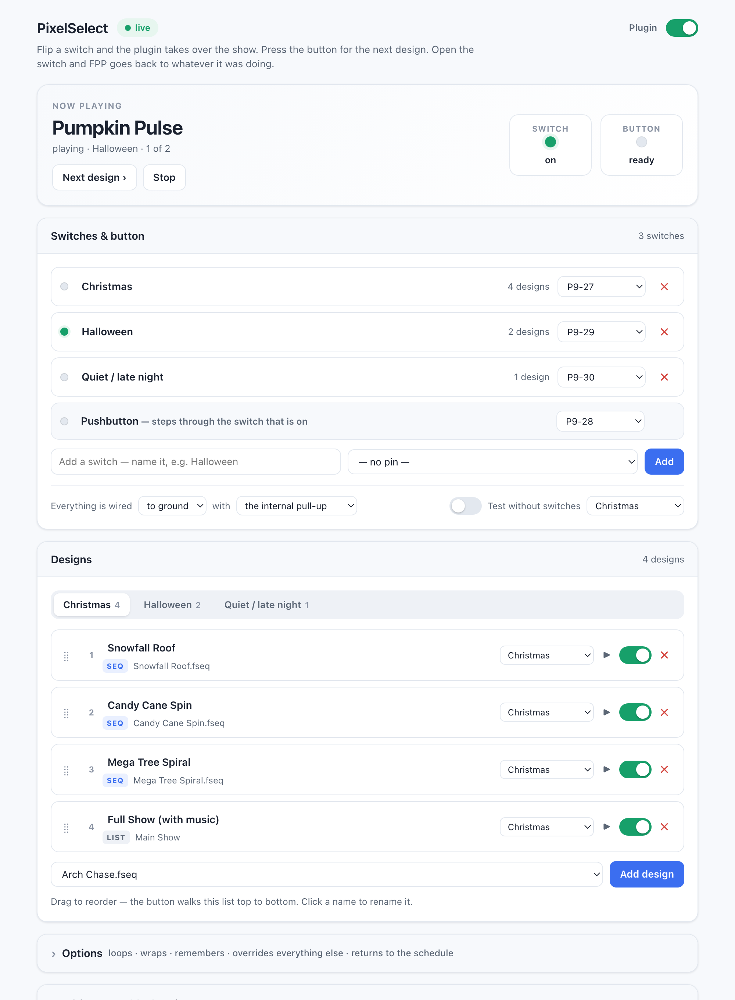
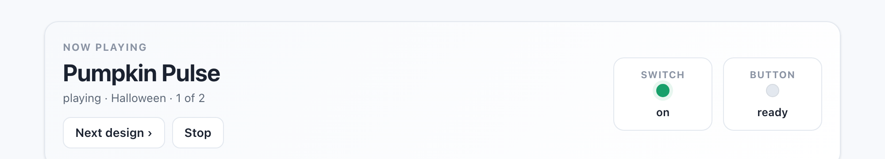
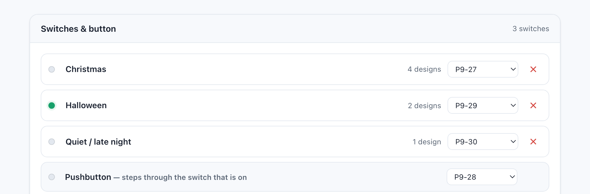
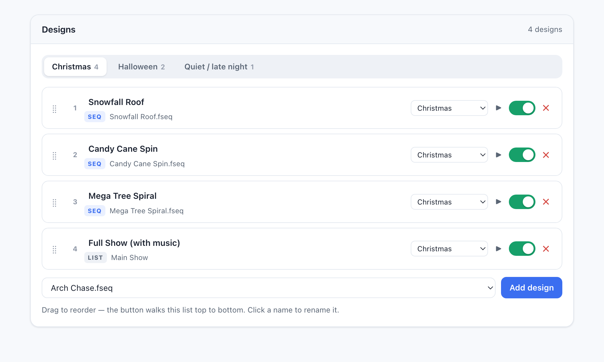
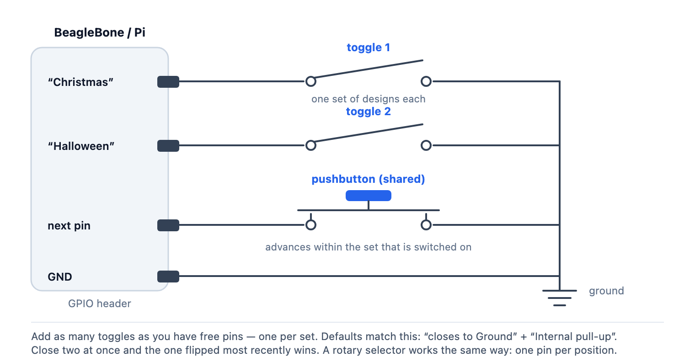
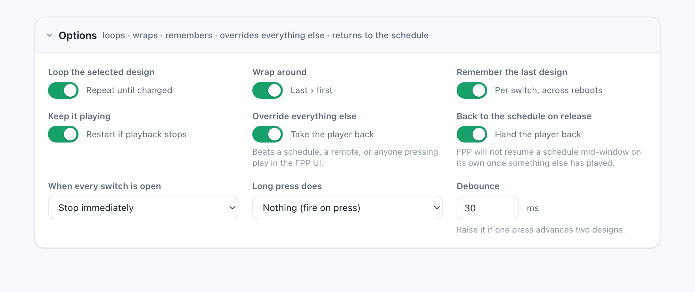

# PixelSelect — pick the show with two GPIO pins

An FPP plugin for a display that people walk up to.

A **toggle switch** hands playback to the plugin and chooses a set of designs. A
**pushbutton** steps through that set. Whatever is selected keeps looping until
the button is pressed again or the switch is flipped off — and while the switch
is on, the plugin holds the player against anything else that tries to take it.

Add as many toggle switches as you have free pins. Each one owns its own set of
designs and remembers which one it was showing, so a panel can offer "Christmas",
"Halloween" and "Quiet" as three separate switches with one shared button.

Both pins are chosen in the plugin's own UI. There is no FPP GPIO Inputs entry to
create and no FPP Command to wire up. The settings page shows both inputs live and
doubles as a virtual pushbutton, so the whole thing can be set up and tested
before a single wire is soldered.

Runs on **FPP 5.4 through 9.x**, BeagleBone and Raspberry Pi, from one source tree.
Verified end to end on a BeagleBone Green running FPP 5.4.1.

<picture>
  <source media="(prefers-color-scheme: dark)" srcset="docs/screenshot-dark.png">
  
</picture>

---

## Contents

- [How it behaves](#how-it-behaves)
- [Several switches, one set each](#several-switches-one-set-each)
- [What a design is](#what-a-design-is)
- [Install](#install)
- [Wiring](#wiring)
- [Settings](#settings)
- [Priority: the switch wins](#priority-the-switch-wins)
- [Giving the schedule back](#giving-the-schedule-back)
- [Trying it without hardware](#trying-it-without-hardware)
- [How it works](#how-it-works)
- [Tests](#tests)
- [Troubleshooting](#troubleshooting)

---

## How it behaves

| Event | What happens |
|---|---|
| A switch closes | That switch's selected design starts and loops. Whatever was playing is interrupted. |
| Button press | Jump to the next enabled design **in that switch's set** and start it. |
| A second switch closes | Hand over to its set. The most recently closed switch wins. |
| That switch opens again | Fall back to whichever switch is still closed. |
| Button press on the last one | Wrap to the first (or hold, if wrap is off). |
| Something else grabs the player | The plugin takes it back within a few seconds. |
| Playback stops on its own | The selected design is started again. |
| Every switch open | Playback stops, and FPP's schedule is handed back. |
| Power cycle | Each switch remembers the design it was last showing. |

The header of the settings page mirrors all of this live — the current design, and
a lamp per pin that follows the real pin level:



## Several switches, one set each

Each switch is one row: a name, how many designs it owns, and its pin. The
pushbutton is the last row of the same list, because it is just another wired
input. The lamp on the left of each row follows the real pin level, so you can
confirm the wiring before adding a single design.

Polarity and the pull resistor are set once for everything, on the line below the
list — in practice every switch on a panel is wired the same way, and repeating
two dropdowns per row only made the page harder to read.



The rules when more than one is closed:

- **The most recently closed switch wins.** Flipping a new one hands over
  immediately.
- **Opening it falls back** to whichever switch is still closed, rather than
  going dark.
- **With every switch open** the plugin stops and gives the schedule back.

That is also exactly what a **rotary selector switch** needs — wire one pin per
position and it behaves as you would expect, because only one position is ever
closed.

Each switch keeps its own place in its own list, so flipping away and back
returns to the design that switch was showing.

## What a design is

Either of the two things already on your device:

| Type | What it is | How it loops |
|---|---|---|
| **Sequence** | an `.fseq` in `media/sequences`, straight out of xLights | FPP builds a one-item playlist for it and repeats that. It also picks up the audio file named inside the fseq header, so a musical sequence just works |
| **Playlist** | an FPP playlist, built however you like | the whole playlist repeats |

Every design belongs to one switch. With more than one switch the design list
grows a tab per switch; the **Add design** picker adds into the tab you are
looking at, and the dropdown on each row moves a design to a different switch.
One picker lists your sequences and playlists together — there is no file type to
choose first.

Mix both types in one set, rename each entry to something an audience would
recognise, drag them into the order the button should walk, and switch entries
off without deleting them. An entry whose sequence or playlist is no longer on the device is
badged **missing** rather than silently doing nothing when the button reaches it.



## Install

In the FPP UI, go to **Content Setup → Plugins**, and in *"Find a Plugin or Enter a
plugininfo.json URL"* paste this **raw** URL:

```
https://raw.githubusercontent.com/joeskolengaden/pixelselect/main/pluginInfo.json
```

Use the raw URL, not the `github.com/.../blob/...` page — FPP 5.x fetches it
directly as JSON, and only 9.x rewrites blob URLs.

Then click **Install**. FPP clones the repo, runs `scripts/fpp_install.sh` to
compile `libpixelselect.so` on the device, and asks to restart.

> **Restart FPP.** Until fppd has reloaded, the badge at the top of the settings
> page reads **not running**, the pins do nothing, and the page cannot show live
> pin state. This is the single most common "it doesn't work" cause.

`allowUpdates` is on, so later commits show an **Update** button that pulls and
rebuilds. Restart fppd after an update too — the running `.so` is only swapped on
restart.

## Wiring

The defaults assume the simplest possible wiring: each switch sits between its pin
and ground, with FPP's internal pull-up holding the pin high while it is open.



If you wire to 3.3 V instead, set *"closes to"* to **3.3 V (active high)** and the
resistor to **Internal pull-down** for that pin. If you fitted your own resistors,
choose **None / external**.

**Choosing pins.** The pickers only offer pins the board actually has — the list
comes from FPP itself, so BeagleBone names look like `P8-11` / `P9-15` and
Raspberry Pi like `P1-11`. Two things to avoid:

- **The pushbutton pin, or another switch's pin.** The plugin refuses to save a
  duplicate, but it is worth knowing before you solder.
- **Any pin listed on Input/Output Setup → GPIO Inputs.** FPP claims those for its
  own command triggers and the two will fight. On a cape with an OLED, the
  navigation buttons usually live there (`P9-17`, `P9-18`, `P9-21`, `P9-22`, `P9-26`).
- **Any pin your cape uses for outputs.** On a 48-string BeagleBone cape that is
  most of the P8 header, which is why the P9 side is usually the free one.

## Settings

### Switches &amp; button

| Setting | Default | Notes |
|---|---|---|
| Name | — | Shown on the design tabs and on the status header. |
| Pin | — | A switch with no pin never becomes active, so an unconfigured plugin cannot fight a schedule. |
| Everything is wired… | to ground, internal pull-up | Applies to every switch and the button at once. Set it to 3.3 V + pull-down for the other polarity, or "no internal resistor" if you fitted your own. |
| Test without switches | off | Behave as if a switch were closed, and choose which one. For testing before anything is wired. |

### Options

Folded away by default, because the defaults are the right answer for almost
everyone. The summary line on the header says what they currently add up to.



| Setting | Default | Notes |
|---|---|---|
| Loop the selected design | on | Repeat until something changes it. |
| Wrap around | on | Off makes the last design the end of the line — pressing next there holds it rather than restarting it. |
| Remember the last design | on | Survives a reboot. A design you have since switched off is skipped rather than resumed. |
| Keep it playing | on | If playback stops on its own, start the selected design again. |
| Back to the schedule on release | on | When the switch opens, nudge FPP's scheduler so a schedule still inside its window resumes. See below. |
| Override everything else | on | While the switch is on, take the player back from a schedule, a remote, or the FPP UI. See below. |
| When every switch is open | Stop immediately | Or finish the current item / the current loop. |
| Debounce | 30 ms | How long an input must hold steady before it counts. Raise it if one press advances two designs. |
| Long press does | nothing | Set it and a short press acts on release instead, so the two can be told apart. |

## Priority: the switch wins

While the enable switch is on, the plugin owns the player. Closing the switch
interrupts whatever was running, and if anything else grabs the player afterwards
— a scheduled playlist starting, a remote, someone pressing play on the FPP status
page — the plugin takes it straight back.

It checks twice a second but only acts after the player has been somewhere else
for two seconds, with a three-second grace period after each of its own starts.
That is deliberately unhurried: the gap between playlist repeats never counts as
losing the player, and it cannot thrash against FPP's scheduler. On a live device
with an active schedule it reclaims once and then holds indefinitely.

Knowing whether the player is still "ours" is done differently per type. A
sequence design is checked with `Sequence::IsSequenceRunning(name)`. A playlist
design is checked by comparing the running playlist name from `/fppd/status`,
because a playlist legitimately changes sequence as it walks through its items.

Turn **Override everything else** off if you would rather a schedule win once it
starts.

## Giving the schedule back

Stopping is not enough on its own, and this is the part that is easy to get wrong.

Once any other playlist has owned the player, **FPP marks the day's scheduled
occurrence as already run and will not restart it mid-window** — not when the
player goes idle, and not on a schedule reload either. Left alone, a device would
simply sit dark after the switch was released and stay that way until the
schedule's next day.

So when the switch opens, the plugin waits for the player to actually go idle (a
graceful stop still gets to finish its item) and then asks the scheduler to look
again, with the "ignore repeat" flag so an already-run in-window item is re-armed.
FPP then starts it through its own scheduled path, which matters: the playlist
keeps its scheduled end time and stop type. Starting the playlist directly instead
would lose both, and the show would run past the time it was supposed to stop.

If nothing is scheduled for right now, the device correctly stays idle.

## Trying it without hardware

You do not need the switches to set this up.

1. Add your designs and pick your pins.
2. Turn on **Test without switches** — the plugin behaves as though a switch
   were closed.
3. Pick which switch it stands in for, if you have more than one.
4. Use **Next design ›** and **Stop** at the top of the page, or the ▶ button on
   any row, as a virtual pushbutton.
5. Turn the override back off. Now wire the real switches and watch the lamps
   follow them.

## How it works

`libpixelselect.so` is a compiled FPP plugin. A worker thread samples both pins
every 5 ms through FPP's own `PinCapabilities`, which is why pin names here mean
the same thing as on FPP's GPIO Inputs page, on both BeagleBone and Pi.

Playback is driven by POSTing `Start Playlist` / `Stop Now` to fppd's command
endpoint on `127.0.0.1:32322` rather than by linking against `Player` or
`CommandManager`. Those headers pull in libhttpserver on 5.4 and drogon on 9.x,
neither of which is reliably present on a device that is only compiling a plugin;
the HTTP command API has been stable across every version in range. The one direct
call into FPP is `Scheduler::CheckIfShouldBePlayingNow`, whose header is
dependency-free and whose signature is identical on 5.4 and 9.x.

Files the plugin owns:

| Path | What |
|---|---|
| `config/plugin.pixelselect` | settings, written by the UI |
| `config/pixelselect_sets.tsv` | the switches, in order: name, pin, polarity, pull |
| `config/pixelselect_designs.tsv` | the ordered design list, each row naming its switch |
| `config/pixelselect_state.txt` | the design each switch was last showing |
| `/dev/shm/pixelselect_status.json` | live status for the UI |
| `/dev/shm/pixelselect_pins.json` | the board's pin names, for the UI pickers |
| `/dev/shm/pixelselect_cmd` | one-shot commands from the UI's virtual button |

The design list is a TSV rather than JSON so the plugin needs no jsoncpp linkage of
its own, which keeps it compiling on a device that only has FPP's headers. The
media directory is found with `dladdr` on the loaded `.so` rather than an FPP
macro, because that macro changed shape between 5.4 and 9.x.

## Tests

The behaviour that is annoying to debug on a Beagle — debounce, ordering, the
switch/next state machine, handover between switches, takeover and hand-back —
runs on a laptop:

```bash
FPPSRC=/path/to/fpp-checkout ./tests/run.sh
```

It compiles the real plugin, `dlopen`s it into a host that stubs the five FPP
symbols the plugin uses, fakes the two GPIO pins, models what is on air, and
answers fppd's command endpoint so every `Start Playlist` can be asserted on.
47 checks, including a bouncing press advancing exactly one design, an enabled
plugin with no pin staying out of playback, reclaiming the player from something
else, handing the schedule back, and a second switch taking over without ever
walking into the first switch's designs. On a device, `FPPSRC=/opt/fpp` works too.

## Troubleshooting

| Symptom | Cause |
|---|---|
| Badge says **not running** | fppd has not been restarted since the install or update, or the build failed — check the install log for `scripts/fpp_install.sh` output. |
| Lamps never change | Wrong pin, wrong polarity, or the pin is also claimed on FPP's GPIO Inputs page or by your cape. |
| The button walks the wrong designs | It always walks the set of the switch that is currently closed. Check the tab and the switch lamps. |
| One press advances two designs | Raise **Debounce**. |
| An entry is badged **missing** | Its sequence or playlist is no longer on the device — re-upload it or remove the entry. |
| Nothing plays, but the lamps look right | The design list is empty, or every entry is switched off. |
| The schedule does not resume after release | Check **Back to the schedule on release** is on, and that a schedule is actually in its time window right now. |
| The plugin keeps interrupting a schedule | That is **Override everything else** doing its job while the switch is closed. Open the switch, or turn the setting off. |

## Licence

GPL-2.0-or-later, matching FPP.
